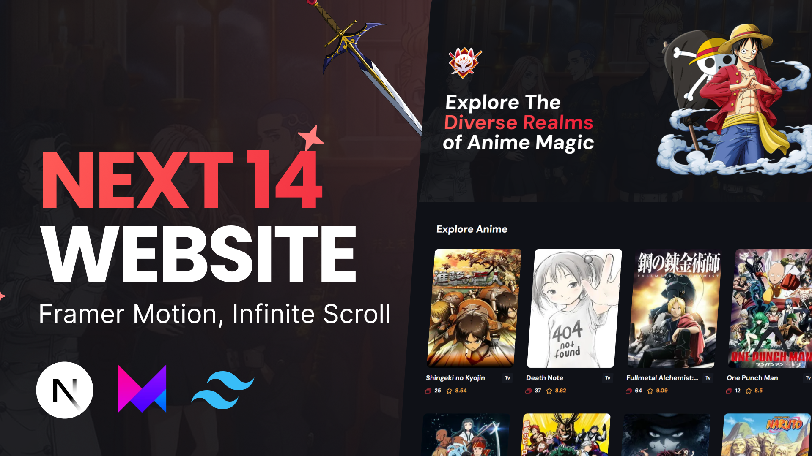

# Anime Nexus Web App

Build a modern and immersive anime experience with Anime Nexus, a Next 14 server-side app featuring server actions, infinite scroll, and Framer Motion animations.

## Overview

Anime Nexus is your gateway to a world of captivating anime content. This web app is designed to provide users with a seamless and engaging experience as they explore the vast and exciting universe of anime.



## Key Features

### 1. Server-Side App

Take advantage of the Next 14 framework to build a robust server-side application. This ensures efficient rendering and faster loading times for a smooth user experience.

### 2. Server Actions

Enhance user interactions with server actions that enable dynamic content updates. Your users can enjoy real-time changes without the need for page reloads.

### 3. Infinite Scroll

Keep your users immersed in a continuous flow of anime content through the implementation of infinite scroll. Say goodbye to pagination and allow your users to seamlessly explore an endless collection of anime.

### 4. Framer Motion Animations

Bring your web app to life with captivating animations powered by Framer Motion. From subtle transitions to eye-catching effects, Framer Motion adds a touch of dynamism to the user interface.

## Getting Started

To get started with Anime Nexus, follow these simple steps:

1. Clone the repository.
2. Install dependencies using your preferred package manager.
3. Configure the server-side settings to suit your requirements.
4. Run the app locally to test its functionality.

```bash
git clone https://github.com/your-username/anime-nexus.git
cd anime-nexus
npm install
npm run dev
```

## Contributing

We welcome contributions from the community to make Anime Nexus even more incredible. Feel free to submit bug reports, feature requests, or pull requests.

Happy coding and exploring the world of anime with Anime Nexus! 🌟
